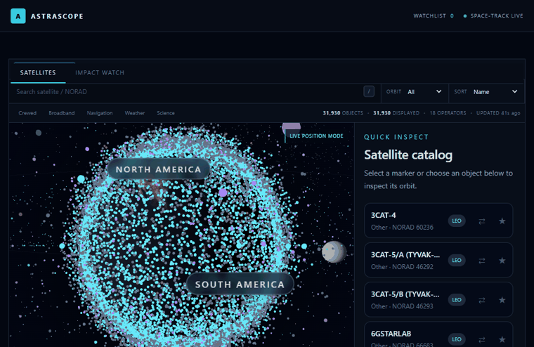

  

<b>IT support at Amazon · Software Engineering at WGU · Chicago</b>

I work in IT support at Amazon and study Software Engineering at WGU. I'm based in Chicago and working toward an SDE role, mostly focused on Python backends and full-stack apps.

Most of my projects use Python, FastAPI, React, and TypeScript. Lately, I've also been looking for open-source projects where I can contribute fixes and tests.

   

## A few things I've been building

🛰️ **[AstraScope](https://github.com/GuillermoBarreto/AstraScope)** — A satellite tracker with an interactive 3D globe. It brings together orbital data, pass predictions, and a FastAPI backend that caches data when providers are unavailable.  
React · TypeScript · Three.js · Python  
[Live demo ↗](https://astrascope-live.vercel.app/)

Recorded preview of AstraScope. Open the live demo to explore the globe.

🔗 **[Shortly](https://github.com/GuillermoBarreto/shortly-scalable-url-shortener)** — A URL shortener with accounts, custom links, and click analytics. The backend uses PostgreSQL for storage and Redis for faster redirects, with tests and Docker setup in the repo.  
FastAPI · PostgreSQL · Redis · React  
[Live demo ↗](https://urlshortener-puce-three.vercel.app/)

🌍 **[OpenSoS](https://github.com/GuillermoBarreto/OpenSoS)** — A map that brings public disaster reports from USGS, NASA, and GDACS into one place, keeping the original sources attached to each event.  
Python · FastAPI · React · MapLibre  
[Live demo ↗](https://opensos-beta.vercel.app/)

## 🛠️ Tech stack

**Languages**

   

**Web & data**

    

**Tools & testing**

    

I keep my coursework, coding practice, and system design notes in [SDE Journey](https://github.com/GuillermoBarreto/SDE-Journey).

## 📊 Stats overview

  

  

<table align="center">
  <tr>
    <td width="50%"></td>
    <td width="50%"></td>
  </tr>
</table>

Stats refresh through external services and may be cached. Language breakdown is by repository; commit hours are shown in UTC. Powered by <a href="https://github.com/DenverCoder1/github-readme-streak-stats">Streak Stats</a> and <a href="https://github.com/vn7n24fzkq/github-profile-summary-cards">Profile Summary Cards</a>.

## 🐍 Contributions in motion

<picture>
  <source media="(prefers-color-scheme: dark)" srcset="assets/snake-dark.svg" />
  <source media="(prefers-color-scheme: light)" srcset="assets/snake.svg" />
  
</picture>

<b>👻 Arcade mode — watch Pac-Man chase my contributions</b>

 

<picture>
  <source media="(prefers-color-scheme: dark)" srcset="assets/arcade/pacman-contribution-graph-dark.svg" />
  <source media="(prefers-color-scheme: light)" srcset="assets/arcade/pacman-contribution-graph.svg" />
  
</picture>

<b>📺 Terminal mode — animated CRT activity dashboard</b>

 

<picture>
  <source media="(prefers-color-scheme: dark)" srcset="assets/crt/crt-dark.svg" />
  <source media="(prefers-color-scheme: light)" srcset="assets/crt/crt-light.svg" />
  
</picture>

Contribution animations refresh daily. Made with <a href="https://github.com/Platane/snk">Snake</a>, <a href="https://github.com/abozanona/pacman-contribution-graph">Arcade Contribution Graph</a>, and <a href="https://github.com/stefashkaa/github-profile-crt">Profile CRT</a>. Header by <a href="https://github.com/kyechan99/capsule-render">Capsule Render</a>.

---

I'm looking for backend and full-stack SDE opportunities. If you'd like to talk about a role or one of my projects, [reach out on LinkedIn](https://www.linkedin.com/in/guillermo-barreto-0034a9270/).
